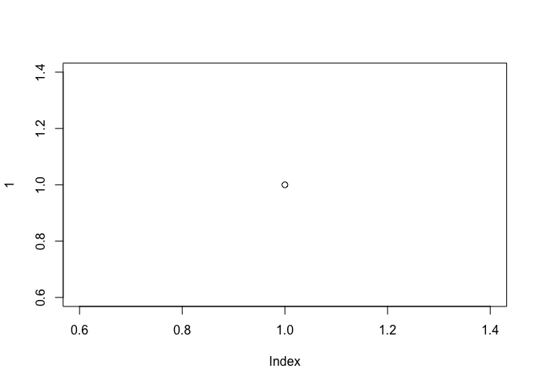

BFAST Open-source collaborative project
================

## Introduction

Here, on Github, we are currently working towards a new BFAST package
for R CRAN. All revelant repositories are located under
<https://github.com/bfast2>

## Major updates on BFAST

  - the BFAST package is made a lot faster by C-code implementation and
    R code improvements by Marius Appel
  - …

## Downloading the current BFAST package on Github

``` r
plot(1)
```

<!-- -->

## BFAST

BFAST, Breaks For Additive Season and Trend, integrates the
decomposition of time series into trend, season, and remainder
components with methods for detecting and characterizing change within
time series. BFAST & BFASTmonitor:

BFAST iteratively estimates the time and number of abrupt changes within
time series, and characterizes change by its magnitude and direction.
BFAST can be used to analyze different types of time series
(e.g. Landsat, MODIS) and can be applied to other disciplines dealing
with seasonal or non-seasonal time series, such as hydrology,
climatology, and econometrics. The algorithm can be extended to label
detected changes with information on the parameters of the fitted
piecewise linear models.

BFASTmonitor provides functionality for monitoring disturbances in time
series models (with trend/season/regressor terms) at the end of time
series (i.e., in near real-time). Based on a model for stable historical
behaviour abnormal changes within newly acquired data can be detected.
Different models are available for modeling the stable historical
behavior. A season-trend model (with harmonic seasonal pattern) is used
as a default in the regresssion modelling.

  - Verbesselt, J., Hyndman, R., Newnham, G., & Culvenor, D. (2010).
    Detecting trend and seasonal changes in satellite image time series.
    Remote Sensing of Environment, 114, 106-115. DOI:
    10.1016/j.rse.2009.08.014. DownLoad Paper

  - Verbesselt, J., Hyndman, R., Zeileis, A., & Culvenor, D. (2010).
    Phenological change detection while accounting for abrupt and
    gradual trends in satellite image time series. Remote Sensing of
    Environment, 114, 2970-2980. DOI: 10.1016/j.rse.2010.08.003.
    DownLoad Paper

  - Verbesselt, J., Zeileis, A., & Herold, M. (2013). Near real-time
    disturbance detection using satellite image time series, Remote
    Sensing of Environment. DOI: 10.1016/j.rse.2012.02.022. DownLoad
    Paper

## References
